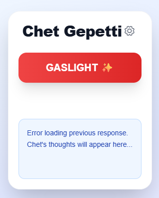

# Chet-Gepetti

Chet-Gepetti is a tongue-in-cheek Chrome extension that roasts Facebook Marketplace listings and fires back a lowball offer on your behalf. It grabs item details from the page, feeds them to OpenAI's API, and types the response directly into the chat box. Inspired by the Michael Reeves's video "[A Bot that Scams People](https://www.youtube.com/watch?v=LwOITqr_fz4)", this project combines browser scripting with Python automation utilities.



## Features

- **One-click gaslighting** – Scrapes the listing title, seller info, price, and description.
- **OpenAI integration** – Generates a sharp, sarcastic reply as "Chet Gepetti" with a lowball offer.
- **Auto-type** – Injects the generated message into the Facebook Marketplace chat box.
- **Persistent settings** – Save your OpenAI API key locally in the extension.
- **Tailwind styling** – Clean popup design with minimal CSS.

## Repository structure

```
Chet-Gepetti/
├── extension/       # Chrome extension source
│   ├── background.js
│   ├── content.js
│   ├── manifest.json
│   ├── popup.html / popup.js
│   ├── styles/
│   └── images/
├── src/             # Helper Python scripts
│   ├── main/
│   ├── utils/
│   └── test/
├── img/             # Example screenshots
├── README.md
└── LICENSE
```

## Getting started

### Prerequisites

- Node.js for building Tailwind assets
- Python 3 for the optional automation scripts
- Google Chrome with Developer Mode enabled
- An OpenAI API key

### Setting up the extension

1. Install the CSS build tool:
   ```bash
   cd extension
   npm install
   npx tailwindcss -i input.css -o styles/tailwind_base.css
   ```
2. In Chrome, open **chrome://extensions** and load the `extension/` folder as an unpacked extension.
3. Click the Chet Gepetti icon, open the settings gear, and paste your OpenAI API key.
4. Browse to a Facebook Marketplace listing and hit **Gaslight**.

### Python utilities

The `src/` directory contains experimental scripts for scraping Marketplace data and packaging the extension. `src/main/main.py` demonstrates using Selenium to pull listing information and generate a response via the OpenAI API.

## Requirements

Python dependencies used by the scripts:

```
openai
python-dotenv
pyautogui
undetected-chromedriver
selenium
```

## License

This project is released under the MIT License. See [LICENSE](LICENSE) for details.

## Contributing

Pull requests are welcome! Feel free to open issues or propose improvements.
